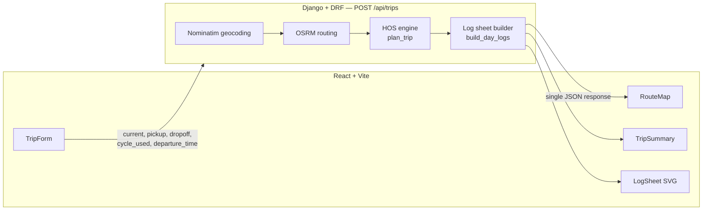

# TripLogger

A full-stack trip planner for property-carrying truck drivers: enter your current location, pickup, dropoff, and current HOS cycle used, and get back a compliant route plan plus FMCSA-style ELD daily log sheets — computed on the fly, no login, no persistence.

**Live app:** <!-- LIVE_URL_FRONTEND --> *(deploy pending)*
**Live API:** <!-- LIVE_URL_BACKEND --> *(deploy pending)*

## Screenshot

<!-- SCREENSHOT: add a screenshot or GIF of the results dashboard (map + stat cards + log sheet) here once the app is deployed. -->

## Architecture

No database persistence — every trip is computed per-request from the four inputs. SQLite exists only for Django internals (admin/sessions), not app data.



Request flow: `POST /api/trips` geocodes the three locations (Nominatim, cached), routes the two legs current→pickup and pickup→dropoff (OSRM), runs them through `plan_trip()` (the pure-Python HOS engine), builds per-day log sheets with `build_day_logs()`, and returns one JSON payload that the map, stat cards, and SVG log sheets all render from — a single source of truth.

```
TripLogger/
├── backend/                  # Django 5 + DRF, Python 3.13
│   ├── config/                # settings, urls, wsgi
│   ├── trips/
│   │   ├── hos/               # pure Python — no Django imports, no I/O
│   │   │   ├── models.py      # DutyStatus, Leg, Segment, Timeline, DayLog
│   │   │   ├── engine.py      # plan_trip(legs, cycle_used_hrs, start_dt) -> Timeline
│   │   │   └── logsheets.py   # build_day_logs(timeline) -> list[DayLog]
│   │   ├── services/
│   │   │   ├── geocoding.py   # Nominatim geocode/reverse, cached, 1 rps
│   │   │   └── routing.py     # OSRM routing, 1 retry then 502
│   │   ├── views.py, serializers.py, urls.py
│   │   └── tests/             # pytest + pytest-django, network fully mocked
│   └── requirements.txt
├── frontend/                  # React 18 + Vite + TypeScript
│   └── src/
│       ├── api/                # typed client, response types mirror API contract
│       ├── components/         # TripForm, RouteMap, LogSheet, TripSummary, DayTabs
│       └── styles/              # FMCSA navy palette, Inter, tabular-nums
└── render.yaml
```

## HOS assumptions

These are the simplifications the HOS engine makes, copied verbatim from the design spec:

- Property-carrying driver, 70 hr/8-day cycle, no adverse driving conditions.
- **Cycle budget simplification:** input is a single "cycle used" number, not 8 days of history, so `70 − cycle_used` is treated as a fixed budget replenished only by a 34-hour restart. True rolling drop-off is impossible from the given inputs.
- **Auto 34-hour restart:** when the cycle budget exhausts mid-trip, the engine inserts a 34 h off-duty restart (flagged in UI + summary) rather than rejecting the trip.
- **Single clock:** entire timeline runs in the current location's timezone ("home terminal time" per FMCSA § 395.8). No per-state DST handling.
- **Truck speed floor:** OSRM car-profile durations are floored at distance ÷ 55 mph.
- **Departure time:** optional input, defaults to "now" rounded up to the next 15 min.
- 1 h on-duty (not driving) for pickup and for dropoff. Fuel stop = 30 min on-duty every 1,000 cumulative route-miles.
- Trips over 5,000 route-miles or unroutable pairs are rejected with 422.

## Local development

### Backend (Django + DRF)

```bash
python -m venv backend/.venv
# Windows:
backend\.venv\Scripts\activate
# macOS/Linux:
source backend/.venv/bin/activate

pip install -r backend/requirements.txt
```

Set `DEBUG=1` for local dev — this enables `CORS_ALLOW_ALL_ORIGINS` (so the Vite dev server can call the API without extra config) and lets you use the insecure fallback `SECRET_KEY`. Without it the app defaults to production-safe settings (`DEBUG=0`) and CORS will reject the frontend origin unless `CORS_ALLOWED_ORIGINS` is also set.

```bash
# from backend/
set DEBUG=1        # PowerShell: $env:DEBUG=1 ; bash: export DEBUG=1
python manage.py runserver
```

The API is served at `http://127.0.0.1:8000/api/trips`.

### Frontend (React + Vite)

```bash
# from frontend/
npm install
npm run dev
```

Optionally point the frontend at a non-default backend with `VITE_API_URL` (e.g. in `frontend/.env.local`):

```
VITE_API_URL=http://127.0.0.1:8000
```

## Running tests

```bash
# backend — from backend/, with the venv activated
python -m pytest

# frontend — from frontend/
npx vitest run
```

Backend: 36 pytest cases covering the HOS engine (break/rest/cycle/restart rules, invariants), log-sheet building, polyline interpolation, geocoding/routing services (network mocked), and the API view (happy path + every error class). Frontend: vitest covers the log-sheet SVG step-path builder; visual/motion correctness is verified in-browser during development.

## API contract

`POST /api/trips`

**Request body:**

| Field | Type | Notes |
|---|---|---|
| `current_location` | string | free-text location, geocoded server-side |
| `pickup_location` | string | free-text location |
| `dropoff_location` | string | free-text location |
| `current_cycle_used` | number | hours already used in the 70 h/8-day cycle, 0–70 |
| `departure_time` | string (ISO 8601), optional | defaults to "now" rounded up to the next 15 min |

**Response body (200):**

| Key | Description |
|---|---|
| `locations` | geocoded `current` / `pickup` / `dropoff`, each with `query`, `display_name`, `lat`, `lng` |
| `route` | route `geometry` (lat/lng polyline), `total_miles`, `total_duration_hrs` |
| `summary` | trip-level totals: `total_days`, `total_miles`, `driving_hrs`, `on_duty_hrs`, `rest_stops`, `fuel_stops`, `breaks`, `restart_inserted`, `arrival` |
| `stops` | ordered list of stops (`pickup`, `dropoff`, `fuel`, `break`, `rest`, `restart`) with coordinates, arrival time, duration, and mile mark |
| `segments` | ordered duty segments (`off`, `sleeper`, `driving`, `on_duty`) with start/end time and mileage |
| `logs` | one entry per calendar day: 15-min-snapped `grid` covering 0–1440 min, per-status `totals` (sum to 1440), `total_miles`, and `remarks` (city/state + note at each duty change) |

**Errors** (all shaped as `{ "detail": "...", "field": "..."? }`, rendered verbatim by the UI):

- `400` — validation failure (missing fields, `current_cycle_used` outside 0–70)
- `422` — geocode not found (names the offending field), unroutable leg, or trip exceeds 5,000 route-miles
- `502` — Nominatim or OSRM unavailable after one retry

## Tech stack

- **Backend:** Python 3.13, Django 5, Django REST Framework, requests (Nominatim/OSRM clients), gunicorn + whitenoise for production, pytest + pytest-django
- **Frontend:** React 18, Vite, TypeScript, react-leaflet (OSM tiles), GSAP (`@gsap/react`) for motion, vitest
- **Deployment:** Vercel (frontend), Render free tier (backend)
